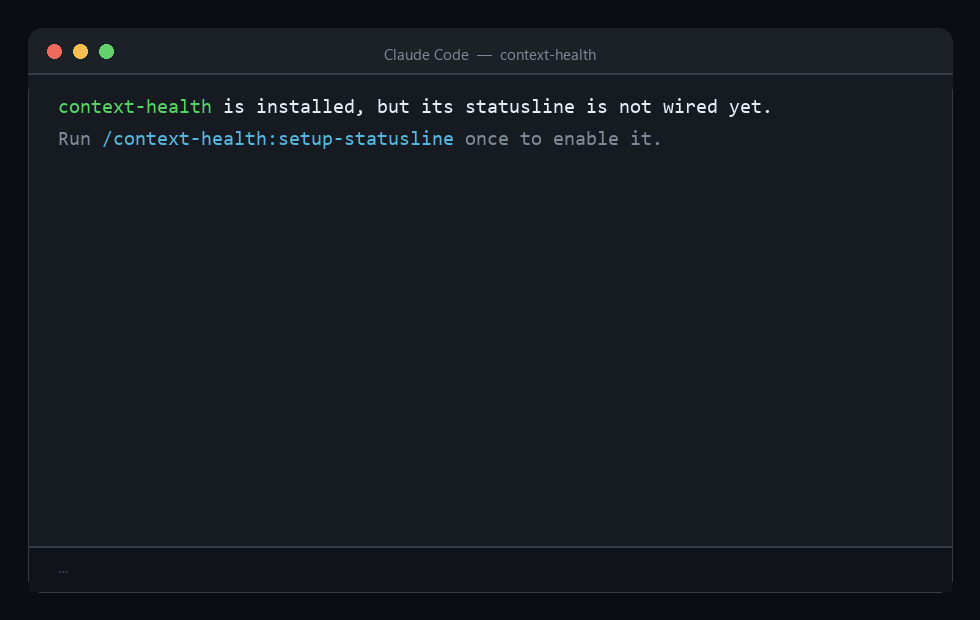

# Context Health Detector for Claude Code

[](https://github.com/s1ddh-rth/context-health/actions/workflows/ci.yml)
[](./LICENSE)


Everyone can see how *full* their context is. Nobody can see whether it has gone
*bad*. This Claude Code **plugin** watches a session live and flags the ways
context degrades — **distraction, confusion, goal-drift, and contradiction** —
surfaced as a color-coded health signal in the statusline that stays silent until
something is actually wrong.

Local-first, **zero API cost by default**, and **fully open-source — no paid
tier**. The first three detectors run entirely locally; the contradiction
detector is opt-in and off by default (and, when you turn it on, runs on your own
API key or a local model).

<p align="center">
  
</p>

> Originally framed as five failure modes (Breunig's poisoning/distraction/
> confusion/clash plus goal-drift). Research showed **clash and poisoning collapse
> to the same local computation** — contradiction detection — so they're merged
> into one **contradiction** detector rather than shipped as two redundant,
> false-alarm-prone heuristics. Distraction, confusion, and goal-drift each keep a
> distinct, independently-calculable signal.

> **Status: v0.1.5 — all four detectors shipped and working.** Distraction,
> confusion, and goal-drift run locally with **zero API cost**; the opt-in
> contradiction detector runs on your own key or a local model. Backed by an
> **eval harness** (measured precision/recall, not just token counts),
> data-calibrated thresholds, and **plain-language config slash commands**.
> See the [Roadmap](#roadmap) for what's next.

---

## What you get

A statusline that beats a plain token counter:

- **Corrected context fill.** The raw `used_percentage` is measured against the
  full window, but Claude Code reserves a ~33k-token autocompact buffer you can't
  use. We report fill against the *usable* window, so the number hits 100% exactly
  when autocompaction fires — not at the hard limit. The corrected number is
  always higher than the raw one, which is the honest read.
- **Distraction detector.** Watches the recent tool-call stream for repetition
  (the "Pokémon failure mode" — the agent repeating past actions) and combines it
  with context fill. Either signal alone can warn.
- **Confusion detector.** Flags when too many tools are active (selection accuracy
  collapses past ~30) or the tool-error rate climbs.

The line stays green (and shows the fill %) until a detector trips, then turns
yellow or red, names the condition, and shows a short **evidence-based remedy
inline** (dimmed, after the `→`) so the fix is one glance away:

```
● ctx 24%                                                                    ← healthy, ambient
● confusion: 31 tools active → disable unneeded tools — fewer choices sharpen selection   ← yellow
● distraction: context 90% full → compact now, or start fresh and reload the essentials   ← red
● goal drift: drifting from goal (46% similar) → restate your goal and re-anchor           ← yellow
```

**Goal-drift.** At the first prompt the session's goal is captured and
embedded (locally, 384-dim FastEmbed / BAAI/bge-small-en-v1.5). Each turn a warm
background worker embeds a rolling window of recent activity and measures its
cosine similarity to the goal — rising distance is drift. The goal-defining
prompt is excluded from the activity window so the goal isn't compared against
itself. A short goal is treated as a *weak anchor*, which raises the bar to fire
and cuts false alarms. All of this runs in a background process so the hooks and
statusline never load the model.

---

## Install

```
/plugin marketplace add s1ddh-rth/context-health
/plugin install context-health@context-health
/context-health:setup-statusline
```

The first two commands install the hooks, skills, and background worker. The
third is a **one-time** step that puts the health signal in your statusline.

Why the extra step: Claude Code does not let a plugin register a global
statusline on its own — the statusline command lives in *your* own
`~/.claude/settings.json`. Rather than make you hand-edit JSON and paste a path
that would break on the next plugin update, `/context-health:setup-statusline`
wires it for you, pointing at a stable location that survives updates. It backs
up your settings first, is safe to run more than once, and **never overwrites an
existing custom statusline** — if you already have one, it just prints the exact
line to add. Restart Claude Code (or open a new session) afterward to see it.

If you install and forget this step, the plugin reminds you once at the next
session start — it never wires anything silently.

To remove the statusline later, run the same script with `unsetup-statusline`
(the setup command prints the exact path), or just uninstall the plugin.

**Prerequisites.** Node (bundled with Claude Code's environment) for the hooks
and statusline, and [`uv`](https://docs.astral.sh/uv/) for the Phase 2 worker.
The worker's Python environment is created and managed automatically by `uv` in
an isolated `.venv` — no global installs, no manual setup. The embedding model
downloads once (~67 MB, quantized ONNX) on first use, after which the tool is
fully offline. If
`uv` or the model is unavailable, goal-drift simply stays quiet; distraction,
confusion, and the corrected context math keep working with zero dependencies.

---

## How it works

Three native Claude Code primitives, wired through one shared state file.

| Primitive | Role |
|---|---|
| **Hooks** | `SessionStart`, `UserPromptSubmit`, `PreToolUse`, `PostToolUse`, `Stop` each drop a raw signal (a tool call, a prompt, an error flag) into the state file. Fast, observation-only, never block. |
| **Statusline** | The only place with live context metrics. Reads the state file, evaluates the detectors over the accumulated signals, renders one colored line. Read-only on state, so it stays fast. |
| **State file** | `~/.claude/context-health-state.json`, keyed by `session_id`. Hooks write raw signals; the statusline reads. Last write wins. |

Everything heavy is deferred. The observation hooks run `async` so Node's
start-up never blocks the session, and the detectors run over small bounded
arrays already in the state file, never by re-scanning the transcript. Because
async hooks (and, in phase 2, the warm worker) can write concurrently, every
state write takes a short cross-process lock, so no update is ever lost.

### Layout

```
context-health/
├── .claude-plugin/       manifest + marketplace manifest
├── hooks/hooks.json      registers the five lifecycle hooks
├── statusline/           the color-coded renderer entry point
├── monitors/             background-worker declaration (Phase 2)
├── bin/
│   ├── hooks/            one thin entry script per hook
│   └── lib/              tested pure logic (detectors, math, state, config)
├── skills/               plain-language config slash commands
├── worker/               Python warm worker (uv-managed, isolated .venv)
│   ├── context_health_worker/   embedder, drift, contradiction, judge, worker
│   ├── eval_drift.py     goal-drift threshold calibrator (real model)
│   └── tests/            pytest suite
├── eval/                 eval harness — metrics, labeled corpus, runner
├── settings.json         default config incl. all tunable thresholds
├── fixtures/             mock stdin payloads for testing scripts
└── test/                 node:test unit + integration tests
```

The worker reads the raw signals the Node hooks write, computes drift out of
band, and writes `computed.goalDrift` back — the two languages share the state
file (and its cross-process lock) but never call each other directly.

---

## Cost, data, and footprint

**Tokens.** In steady state the plugin adds **zero** tokens to your context. The
five hooks and the statusline only read and write a local file; none of them
inject text into the conversation, and the statusline is a display surface, not
model context. Two paths are deliberate exceptions, each a single line: a
**one-time** first-run nudge if you haven't wired the statusline yet, and a
**red-transition alert** the worker emits when a session first crosses into red
(and, *only* if you've enabled the opt-in contradiction detector, its red alert
too). Both are injected into context by design so the model can react — that's
the whole point of a precision-first signal that stays silent until something is
actually wrong.

**Money.** `$0` by default. The only component that can ever spend is the opt-in
contradiction detector — off by default and, when on, running on **your own**
Claude key or a **local** model. Never a tier billed by this plugin.

**What leaves your machine.** Nothing, for the three default detectors —
goal-drift embeds locally with FastEmbed and makes no network call. The single
exception is the opt-in **BYOK** contradiction judge: when enabled, at most once
every 3 turns it sends your **recent user prompts** (last 8, capped at ~4000
chars each), **recent tool names, and a tool-parameter signature** to the
Anthropic API under your own credentials. The **local** judge
(`localhost:11434`) sends nothing off-box.

**Resources.** The background worker polls the state file every **1.5 s**
(tunable via `pollIntervalSeconds`) and only does embedding work when a turn has
actually advanced — otherwise the tick is a cheap file read. It keeps the ~67 MB
model resident for the session so it never reloads; the hooks and statusline
never load the model at all.

---

## Configuration

Every detector threshold is a **provisional default** (build-spec §5.6), tunable
without hard-coding. Resolution order (later wins):

1. Built-in defaults (baked into `bin/lib/config.js` — the tool works even with
   no config file).
2. The plugin's `settings.json`.
3. A user override at `~/.claude/context-health-config.json` — where the
   slash commands write tuned values, so you never edit plugin JSON by hand.

Key knobs (`detectors.distraction`, `detectors.confusion`):

| Setting | Default | Meaning |
|---|---|---|
| `repetitionRateYellow` / `Red` | 0.30 / 0.50 | share of recent tool calls that are repeats |
| `contextFillYellow` / `Red` | 50 / 85 | corrected fill % bands |
| `activeToolYellow` | 30 | active-tool ceiling before confusion warns |
| `toolErrorRateYellow` / `Red` | 0.05 / 0.10 | failed tool calls over the recent window |

`enabled: false` silences the plugin entirely; `muted: true` (global or
per-session) keeps the ambient fill but suppresses warnings.

### Slash commands (no JSON editing)

Config is plain-language slash commands — they write to your user override file,
never to plugin files:

| Command | Does |
|---|---|
| `/context-health:status` | show current detectors + thresholds |
| `/context-health:set-threshold <detector> <key> <value>` | tune a threshold (e.g. make goal-drift less sensitive) |
| `/context-health:mute` / `mute off` | silence warnings this session (fill still shows) |
| `/context-health:reset-goal` | re-anchor goal-drift; your next prompt becomes the new goal |
| `/context-health:toggle-contradiction on\|off [byok\|local] [model]` | enable the opt-in contradiction detector (BYOK by default, or a local model — see below) |

### The contradiction detector (opt-in, off by default)

Research showed clash and poisoning collapse to one computation — contradiction
detection — that local heuristics can't do precisely. So it's a single opt-in
detector that, when enabled, runs an LLM judge on **your own** Claude API key
(the official SDK resolves your existing credentials — nothing to paste) or a
**local** model. It is never billed by this plugin, off by default, and
throttled. The API-key judge needs a one-time `cd worker && uv sync --extra
contradiction`; a local model needs no install.

Turn it on with one command — BYOK or local:

```
/context-health:toggle-contradiction on                    # BYOK (default judge: claude-haiku-4-5)
/context-health:toggle-contradiction on local llama3.1     # local (OpenAI-compatible endpoint, e.g. Ollama on :11434)
```

**Use a capable judge.** Contradiction detection is natural-language inference —
precision depends on the model. In testing, a tiny 0.5B local model correctly
caught a real contradiction but also *false-alarmed on a clean session*; a
false alarm is worse than a miss here, so pick a capable judge — Claude Haiku
(BYOK) or a ≳7–8B local model such as `llama3.1`. The judge hits a standard
OpenAI-compatible endpoint (`localhost:11434/v1/chat/completions` by default),
so any Ollama/LM-Studio/vLLM server works.

## Proving it works — the eval harness

Everyone counts tokens; nobody proves their detector is right. This one does.

```
node eval/run-eval.js                       # per-detector precision / recall / FPR + confusion matrix
uv run --directory worker python eval_drift.py   # calibrate goal-drift thresholds on labeled pairs
```

The eval runner feeds a labeled fixture corpus through the **production**
detectors and reports precision, recall, F0.5 (precision-weighted), and the
false-positive rate per detector — the numbers a precision-first product lives
and dies on. The drift calibrator scores labeled on-goal/drifted pairs with the
real embedding model and recommends thresholds; that's how the provisional
spec default (yellow 0.70) became the calibrated **0.55/0.50** — on the labeled
set, on-goal pairs bottom out at cosine **0.559** and drifted pairs average
**0.450**, so yellow **0.55** sits just under the on-goal floor (**0 false
alarms, 93% recall**) while the 0.70 spec default sat *above* the entire on-goal
distribution and would fire on healthy sessions.

The labeled set is small (~30 pairs) and its drifted examples are clear topic
changes, not the gradual, domain-adjacent drift of real sessions — so treat
0.55/0.50 as *better-calibrated defaults, still tunable*, not a final answer.
Grow `eval/drift-pairs.json` with real-transcript pairs and re-run the
calibrator to refine them (they're a `/context-health:set-threshold` away).

---

## Development

```
npm test                       # Node: node:test, zero dependencies
cd worker && uv run pytest -q  # Python worker: pytest in the isolated env
```

Test any script the way Claude Code will invoke it — pipe a fixture on stdin:

```
node statusline/statusline.js < fixtures/statusline-healthy.json
node bin/hooks/pre-tool-use.js < fixtures/hook-pre-tool.json
```

Design rules the code holds itself to: hooks and statusline never crash (bad
input → fallback, always exit 0); scripts write only their own clean output to
stdout; the `Stop` hook checks `stop_hook_active` to avoid infinite loops; and
transcript/tool output is treated as untrusted text, never executed.

---

## Roadmap

- **Phase 1 — plumbing + free wins** *(done)*: scaffold, corrected context math,
  distraction + confusion detectors. Zero cost.
- **Phase 2 — the lead feature** *(done)*: local FastEmbed embedding model in a
  warm worker, goal-drift detector.
- **Phase 3 — rigor + the opt-in detector** *(done)*: eval harness (labeled
  corpus, precision/recall/FPR metrics, threshold calibration), config slash
  commands, and the opt-in **contradiction** detector (LLM-judge on your own key
  or a local model, off by default).
- **Phase 4 — reach**: desktop-app port, optional MCP companion.

## Troubleshooting

- **Statusline doesn't appear after setup.** Wiring writes your settings, but a
  session already running won't pick it up — restart Claude Code or open a new
  session.
- **`uv` not found.** The worker (and goal-drift) needs
  [`uv`](https://docs.astral.sh/uv/). Install it and restart; distraction,
  confusion, and the corrected context math keep working without it.
- **Model won't download (offline / firewall).** First run fetches the ~67 MB
  model once. If it can't reach the network, goal-drift simply stays quiet and
  the other detectors keep working — retry when you're back online.
- **Setup reports it can't find the data path.** `/context-health:setup-statusline`
  needs Claude Code to supply `CLAUDE_PLUGIN_DATA`. On versions that don't export
  it, setup no-ops with a message instead of wiring anything — re-run it on a
  current Claude Code.

## Uninstall & on-disk files

`/plugin uninstall context-health@context-health` unregisters the hooks and
worker but leaves a few files behind. To fully clean up:

- **Statusline wiring** — run the setup script with `unsetup-statusline` (the
  setup command prints the exact path); it restores your backed-up
  `~/.claude/settings.json`.
- **Shared state** — `~/.claude/context-health-state.json`
- **Your tuned config**, if you created one — `~/.claude/context-health-config.json`
- **Materialized statusline copy + first-run flag** — the `current/` folder and
  the sibling `.setup-nudged` file under the plugin's data dir
  (`<CLAUDE_PLUGIN_DATA>`).
- **Embedding model (~67 MB)**, optional — it lives in **FastEmbed's own default
  cache** (under your system temp / `HF_HOME`, not under `~/.claude`), so remove
  it there if you want the space back.

## Known limitations

These are Claude Code version-dependent behaviors, not bugs in this plugin — the
plugin degrades gracefully in each case:

- **The warm worker may not auto-start on some Claude Code versions.** Plugin
  background monitors have been reported to silently fail to arm on certain
  releases. If the statusline never shows goal-drift (it stays green even when
  you've clearly changed topic), the worker probably isn't running. Start it
  manually — it's the same command the monitor uses:

  ```
  uv run --directory "<plugin-dir>/worker" python -m context_health_worker.worker
  ```

  (`<plugin-dir>` is the installed plugin path, i.e. `${CLAUDE_PLUGIN_ROOT}`.)
  Distraction, confusion, and the context math all work without the worker.

- **Config slash commands are marked user-only** (`disable-model-invocation`),
  but some Claude Code versions ignore that flag for *plugin* skills, so the
  model could invoke them from context. All of them are reversible and low-harm
  (mute, tune a threshold, reset the goal, toggle the off-by-default detector);
  none touch your code or data.

## How it computes things (and why)

Every detector's formula, thresholds, and the **evidence** behind them are documented
in [`docs/METHODOLOGY.md`](./docs/METHODOLOGY.md) — what each of the six variables is,
how it's calculated, why the numbers are what they are, and the (verified) sources.

## Contributing

Contributions are welcome — especially better labeled data for calibration and
false-alarm reports. See [CONTRIBUTING.md](./CONTRIBUTING.md) for setup, the test +
eval gates, and the DCO sign-off. This project follows a
[Code of Conduct](./CODE_OF_CONDUCT.md); security reports go through
[SECURITY.md](./SECURITY.md).

## License

[MIT](./LICENSE) © 2026 s1ddh-rth
